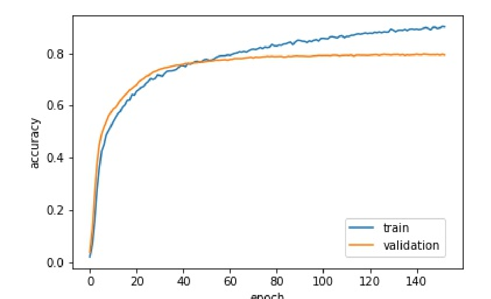

# Action Recogniton for Table Tennis Video
- 3D ResNet-18
- Trained from Kinetics pretrained models
- Trained on Table Tennis Dataset, top1 accuracy: 83.6%

# Loss Curve

# Demo Link
- [demo0](https://drive.google.com/file/d/1aEW3mU3onQ610QMdgFFN2Ty9pTkqBnBE/view?usp=sharing)
- [demo1](https://drive.google.com/file/d/1WnQKW7Za7wnWIYRTrilVJdGxlocnY5HL/view?usp=sharing)
- [demo2](https://drive.google.com/file/d/18F6uWXOpBS0gL8PMWb8t3xf8D-G2yYfA/view?usp=sharing)

# Reference
- Hara, Kensho, Hirokatsu Kataoka, and Yutaka Satoh. "Can spatiotemporal 3d cnns retrace the history of 2d cnns and imagenet?." Proceedings of the IEEE conference on Computer Vision and Pattern Recognition. 2018.
- https://github.com/kenshohara/3D-ResNets-PyTorch
- Tran, Du, et al. "Learning spatiotemporal features with 3d convolutional networks." Proceedings of the IEEE international conference on computer vision. 2015.
